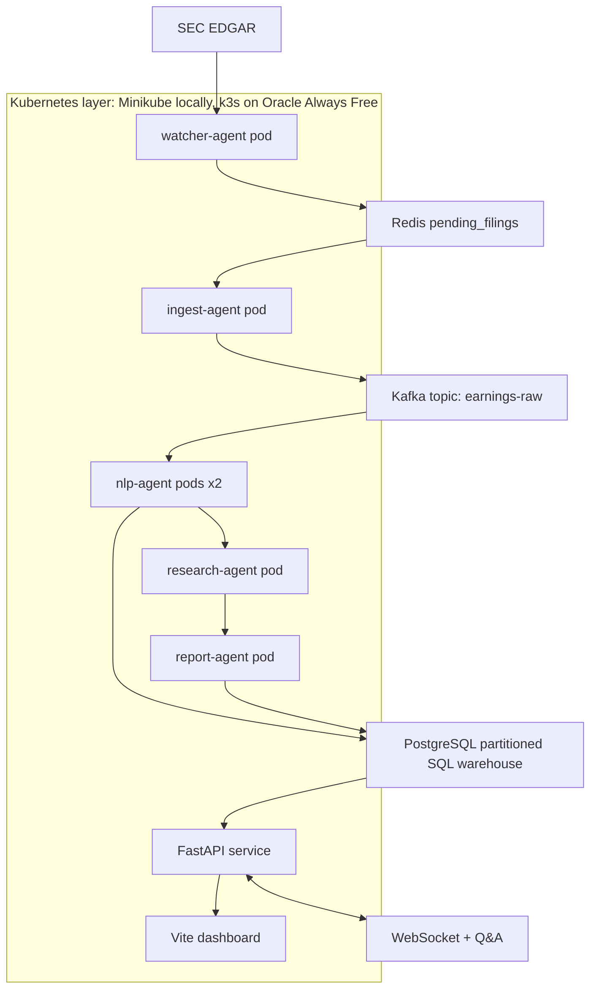
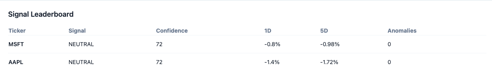
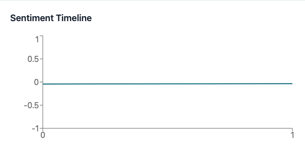
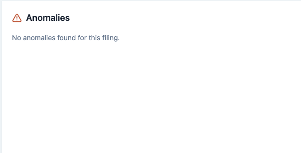
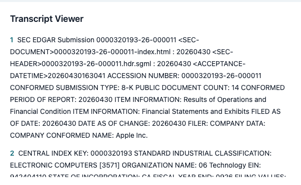
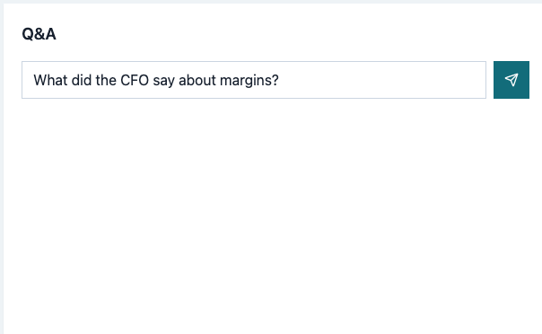
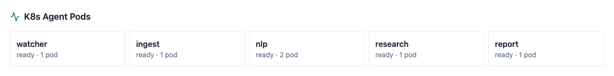
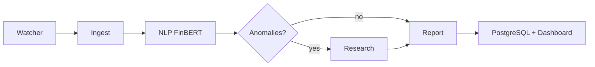

# EarningsIQ - Earnings Call Intelligence Engine

**What CFOs say, what the market misses.**

EarningsIQ is a production-structured,intelligence engine for SEC EDGAR earnings-call filings. It runs locally with Docker Compose, can be deployed to Minikube or k3s, and uses five LangGraph agents to ingest filings, score sentence sentiment with FinBERT, detect anomalous language, research context, and generate a structured signal report with Groq free tier or local Ollama.

## Architecture



## Why Not Stock Prediction

EarningsIQ does not claim to predict stock prices. It identifies language signals that can be missed in long earnings-call text, then compares those signals with price movement for validation. The output is decision support for research workflows, not financial advice.

## Screenshots

> Run `make up` then `make ingest TICKER=AAPL` to see the live dashboard.

### Signal Leaderboard — Top anomalous companies this week


### Sentiment Timeline — FinBERT score per sentence across earnings call


### Anomaly Cards — Flagged executive language with Z-score


### Transcript Viewer — Color-coded by sentiment score


### AI Q&A — Ask anything about the earnings call


### Kubernetes Pod Status — All 5 agents running


## Quick Start

```bash
cd ~/Desktop/earningsiq
cp .env.example .env
make up
```

Open:

- Dashboard: http://localhost:5173
- API docs: http://localhost:8000/docs
- Health: http://localhost:8000/health

Run a local pipeline from another terminal:

```bash
make ingest TICKER=AAPL
```

GitHub-style start:

```bash
git clone https://github.com/Mohammed-Saif-07/earningsiq
cd earningsiq
cp .env.example .env          # add your free Groq key
make up                       # docker compose local
make ingest TICKER=AAPL
minikube start
make k8s-up
```

## API Keys And Accounts

You can run with no paid services. Default `.env` uses `LLM_PROVIDER=ollama`, which needs a local Ollama install:

```bash
brew install ollama
ollama serve
ollama pull llama3
```

For Groq free tier:

1. Create a free account at https://console.groq.com
2. Create an API key.
3. Open `.env` in the project root and fill in your keys.
4. Set `LLM_PROVIDER=groq`.
5. Paste the key into `GROQ_API_KEY=...`.
6. Keep `GROQ_MODEL=llama3-8b-8192`.

For Kubernetes demos:

1. Install Docker Desktop.
2. Install Minikube with `brew install minikube`.
3. Start it with `minikube start --cpus 4 --memory 8192`.
4. Run `eval $(minikube docker-env)`.
5. Build images named in the manifests or point the image names to your local registry.
6. Run `make k8s-up`.

For Oracle Cloud Always Free k3s:

1. Create an Oracle Cloud free account.
2. Launch an Always Free ARM or AMD VM.
3. Install k3s with the official install script.
4. Copy this repo to the VM.
5. Build and load images into k3s/containerd.
6. Run `make k8s-up`.

## SQL Schema ERD

`companies` owns `filings`; `filings` owns `sentence_sentiments`, `anomaly_events`, `signal_context`, `signal_reports`, and `signal_correlations`. `price_snapshots` tracks daily prices by company and ticker. `agent_run_log` records each agent execution, while `kafka_offsets` tracks streaming consumer progress. The warehouse includes range partitions for filings, list partitions for sentence sentiment, analytical views, materialized views, stored functions, triggers, and full-text search.

## Kubernetes Architecture

- `watcher-agent`: polls SEC EDGAR and pushes unseen filing IDs to Redis.
- `ingest-agent`: parses filing text, chunks sentences, and produces Kafka messages.
- `nlp-agent`: runs FinBERT CPU scoring, z-score anomaly detection, and scales to two pods.
- `research-agent`: runs only when anomalies exist and adds company context.
- `report-agent`: generates final signal reports with Groq or Ollama.
- `earningsiq-api`: exposes REST, WebSocket, and dashboard data endpoints.
- `earningsiq-frontend`: Vite React dashboard.

## Agent Flow



## Local Development

```bash
python -m venv .venv
source .venv/bin/activate
pip install -r requirements.txt
python -m compileall agents ingestion stream ml llm api pipeline
uvicorn api.main:app --reload
```

Frontend:

```bash
cd frontend
npm install
npm run dev
```

---

Built by Saif Mohammed · MS CS, Seattle University  
smohammed8@seattleu.edu · github.com/Mohammed-Saif-07
